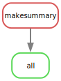
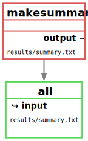

# snakemake-pixi-template

This is a template repository for snakemake workflow with pixi as a package manager.
It is based on the [pixi](https://prefix.dev/blog/pixi_a_fast_conda_alternative).

## Idea

Traditionally, I would use Conda to create my environments and manage my packages.
However the added step of making sure my environment.yml file is up to date is a bit of a hassle.

```bash
conda env create -f environment.yml -n snakemake
conda activate snakemake
```

Instead, I can use pixi to manage my packages and create a `pixi.lock` file that will be used to create the environment.

```bash
pixi install
```

This makes sure that the lock is synchronized and version controlled. 

## Usage

To add packages to the `default` environment:

```bash
pixi add pandas
```

### To run a command in the environment

```bash
pixi run snakemake --dryrun
```

### Enter into the environment

```bash
pixi shell

# Exit the environment using "exit"
```

### Pixi Tasks
Pixi also allows defining tasks for common tasks. This is done in the [pyproject.toml](pyproject.toml) file.

```toml
[tool.pixi.tasks]
dryrun = "snakemake --dry-run"
snake = "snakemake --cores 1"
```

This allows me to run `pixi run dryrun` to see what snakemake would do and `pixi run snake` to run snakemake.

A common task I like to do is creating the dags regularly and including them in my README.
This can then be automated with the task.

```toml
dag = "snakemake -F --dag | dot -Tsvg > resources/dag.svg"
rulegraph = "snakemake -F --rulegraph | dot -Tsvg > resources/rulegraph.svg"
filegraph = "snakemake -F --filegraph | dot -Tsvg > resources/filegraph.svg"
graphs = { depends_on = ["dag", "rulegraph", "filegraph"] }
```

Running `pixi run graphs` will create the three graphs and save them in the resources folder.
This way, they are automatically updated below in this README. 

#### DAG 


#### Rulegraph



#### Filegraph


